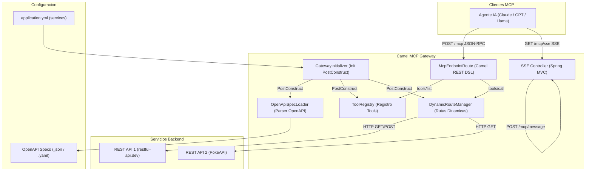
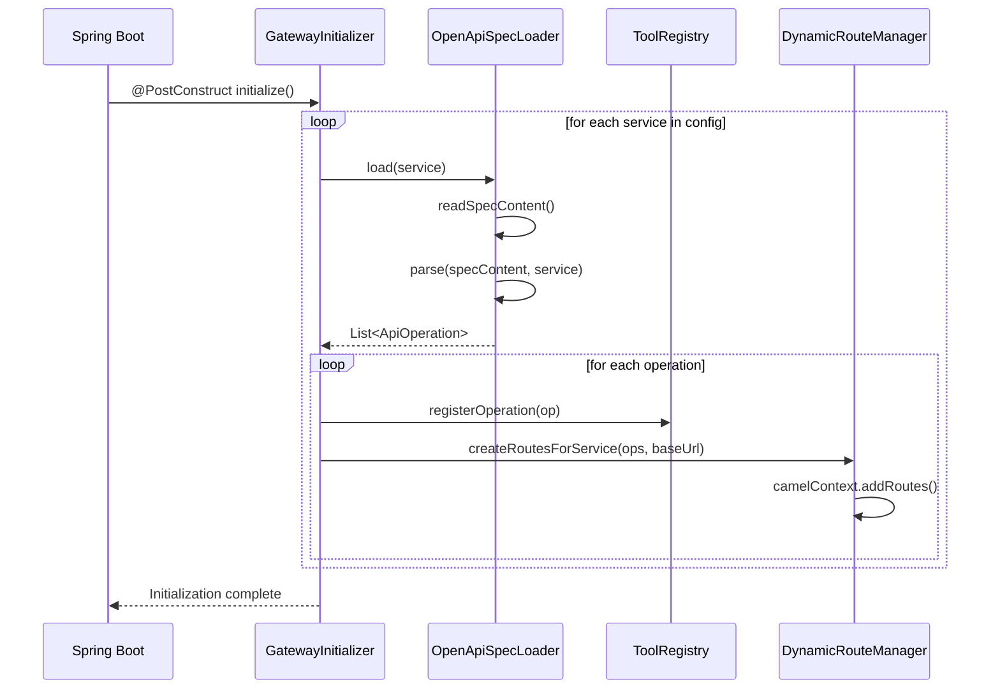
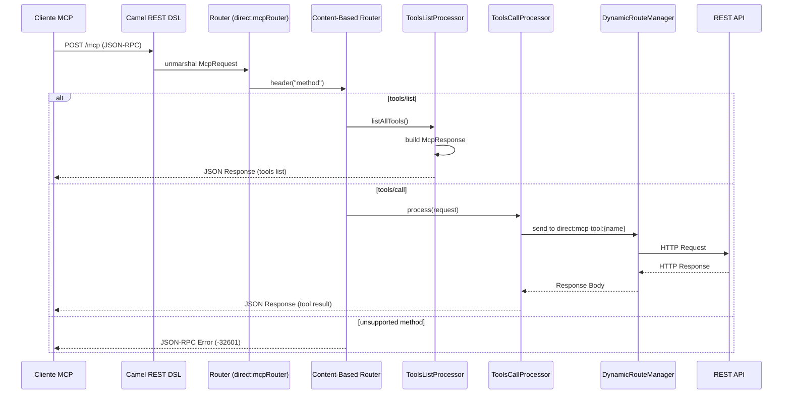
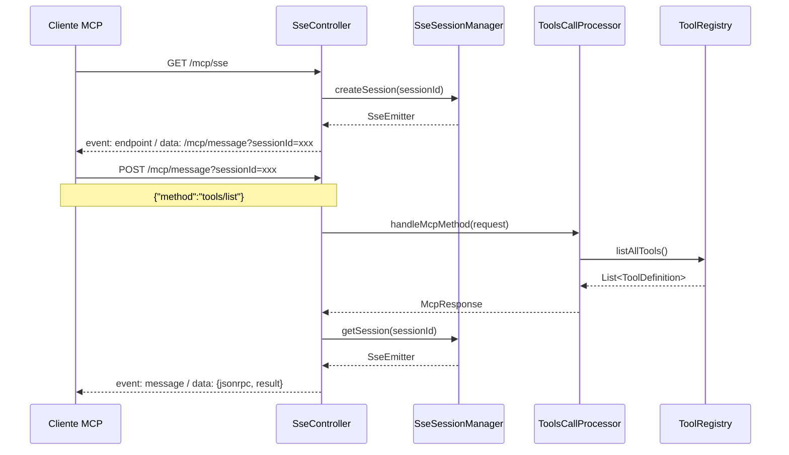

# Camel MCP Gateway

**REST-to-MCP Server** configurable basado en Apache Camel + Spring Boot. Expone cualquier REST API como **herramientas MCP** (Model Context Protocol) consumibles por agentes de IA como Claude, GPT, Llama, etc.

## Stack Tecnológico

| Componente                 | Tecnología              |
|----------------------------|-------------------------|
| Lenguaje                   | Java 17                 |
| Framework                  | Spring Boot 3.5.13      |
| Integración / Enrutamiento | Apache Camel 4.18.2     |
| Servidor HTTP              | Undertow (embedded)     |
| Parseo OpenAPI             | Swagger Parser 2.1.24   |
| Serialización              | Jackson + Camel Jackson |
| Transporte SSE             | Spring MVC `SseEmitter` |
| Build Tool                 | Maven                   |
| IDE                        | IntelliJ IDEA           |

## Arquitectura General



## Estructura del Proyecto

```
src/main/java/com/lespinel/camel/mcp/
├── CamelMcpGatewayApplication.java    # Entry point Spring Boot
├── commons/
│   ├── ErrorController.java           # @RestControllerAdvice global
│   └── GatewayException.java          # Excepción personalizada
├── config/
│   ├── GatewayInitializer.java        # Inicialización @PostConstruct
│   ├── McpGatewayConfig.java          # @ConfigurationProperties
│   └── ServiceDefinition.java         # DTO configuración servicios
├── model/
│   ├── ApiOperation.java              # Operación parseada del OpenAPI
│   └── mcp/
│       ├── McpRequest.java            # Request JSON-RPC 2.0
│       ├── McpResponse.java           # Response JSON-RPC 2.0
│       └── ToolDefinition.java        # Esquema de herramienta MCP
├── openapi/
│   └── OpenApiSpecLoader.java         # Parser OpenAPI 3.0
├── registry/
│   └── ToolRegistry.java              # Registro en memoria de tools
├── routes/
│   ├── DynamicRouteManager.java       # Creación dinámica de rutas Camel
│   ├── McpEndpointRoute.java          # Ruta REST /mcp (Camel REST DSL)
│   └── processors/
│       ├── ToolsCallProcessor.java    # Procesador tools/call
│       └── ToolsListProcessor.java    # Procesador tools/list
└── sse/
    ├── SseController.java             # Endpoints SSE (Spring MVC)
    └── SseSessionManager.java         # Gestión de sesiones SSE

src/main/resources/
├── application.yml                    # Configuración principal
└── openapi/
    ├── pokeapi.yaml                   # Spec OpenAPI PokéAPI
    └── restful-api.json               # Spec OpenAPI Objects API
```

## Componentes en Detalle

### 1. Capa de Configuración (`config/`)

**`McpGatewayConfig.java`** — Mapea las propiedades `app.mcp-gateway.*` del `application.yml` usando `@ConfigurationProperties`.

**`ServiceDefinition.java`** — DTO que define cada servicio backend:
- `name`: identificador único del servicio
- `baseUrl`: URL base del REST API
- `openapiPath` / `openapiUrl`: origen del spec OpenAPI (classpath, file, o URL)

```yaml
app:
  mcp-gateway:
    services:
      - name: objects-service
        base-url: https://api.restful-api.dev
        openapi-path: classpath:openapi/restful-api.json
      - name: pokemons
        base-url: https://pokeapi.co/api/v2
        openapi-path: classpath:openapi/pokeapi.yaml
```

### 2. Inicialización (`GatewayInitializer.java`)

Con `@PostConstruct`, orquesta el bootstrap completo:



### 3. Cargador OpenAPI (`OpenApiSpecLoader.java`)

Lee el spec OpenAPI 3.0 desde múltiples fuentes y lo parsea a `List<ApiOperation>`:

- **Classpath**: `classpath:openapi/restful-api.json`
- **File**: `file:/ruta/absoluta/spec.yaml`
- **URL**: `https://ejemplo.com/api-docs`

Usa `io.swagger.parser.v3.OpenAPIV3Parser` para resolver y flatten el spec. Extrae por cada path+método: `operationId`, `parameters` (path, query), `requestBody` y los mapea a `ApiOperation`.

### 4. Registro de Herramientas (`ToolRegistry.java`)

Almacena en un `ConcurrentHashMap<String, ToolEntry>` todas las operaciones parseadas. Cada `ToolEntry` contiene:

- **`ToolDefinition`**: esquema MCP (`name`, `description`, `inputSchema`)
- **`ApiOperation`**: metadata de la operación original

Genera el `InputSchema` de cada tool con los parámetros OpenAPI mapeados al formato JSON Schema. El nombre de la tool sigue el patrón `{serviceName}_{operationId}`.

### 5. Enrutamiento Dinámico (`DynamicRouteManager.java`)

Crea rutas Apache Camel dinámicamente usando `camelContext.addRoutes()`. Por cada `ApiOperation` genera una ruta:

```
from("direct:mcp-tool:{serviceName}_{operationId}")
    .process(resolver de path params)
    .toD("${header.fullUrl}")
    .convertBodyTo(String.class)
```

El procesador:
1. Reemplaza `{pathParams}` con valores del mapa `arguments`
2. Construye query string con parámetros query
3. Serializa el `body` si hay `requestBody`
4. Ejecuta la llamada HTTP al backend vía `toD()`

### 6. Endpoint JSON-RPC (`McpEndpointRoute.java`)

Usa **Camel REST DSL** con componente `servlet` para exponer `POST /mcp`:



### 7. Transporte SSE (`SseController.java`)

Implementa el **Streamable HTTP Transport** del protocolo MCP usando Spring MVC `SseEmitter`:

| Endpoint                | Descripción                                 |
| ----------------------- | ------------------------------------------- |
| `GET /mcp/sse`          | Establece conexión SSE, devuelve `event: endpoint` con la URL de mensajes |
| `POST /mcp/message?sessionId={id}` | Envía un mensaje JSON-RPC y recibe respuesta vía SSE |

**Flujo SSE:**



### 8. Manejo de Errores

**`ErrorController.java`** — `@RestControllerAdvice` global que captura cualquier excepción no manejada y devuelve un `500` con el mensaje.

**`GatewayException.java`** — Excepción personalizada para errores de dominio.

**Códigos de error JSON-RPC implementados:**

| Código | Significado               | Escenario                          |
| ------ | ------------------------- | ---------------------------------- |
| `-32600` | Invalid Request         | `method` es `null`                 |
| `-32601` | Method not found        | Método JSON-RPC no soportado       |
| `-32602` | Invalid params          | `params` o `name` faltantes        |
| `-32604` | Tool not found          | `name` no existe en el registro    |

## Ejemplos de Uso

### Listar herramientas disponibles

```bash
curl -s POST http://localhost:8080/mcp \
  -H "Content-Type: application/json" \
  -d '{"jsonrpc":"2.0","method":"tools/list","id":1}'
```

### Ejecutar una herramienta

```bash
curl -s POST http://localhost:8080/mcp \
  -H "Content-Type: application/json" \
  -d '{
    "jsonrpc":"2.0",
    "method":"tools/call",
    "id":2,
    "params":{
      "name":"objects-service_getObjectById",
      "arguments":{"id":"1"}
    }
  }'
```

### Conexión SSE

```bash
# Terminal 1: establecer conexión SSE
curl -N http://localhost:8080/mcp/sse

# Terminal 2: enviar mensajes
curl -X POST "http://localhost:8080/mcp/message?sessionId=<sessionId>" \
  -H "Content-Type: application/json" \
  -d '{"jsonrpc":"2.0","method":"tools/list","id":1}'
```

## Compilación y Ejecución

```bash
# Compilar
mvn clean package

# Ejecutar
mvn spring-boot:run

# Tests
mvn test
```

## Extensibilidad

Para agregar un nuevo servicio backend:

1. Obtén/crea su spec OpenAPI 3.0 (archivo `.json` o `.yaml`)
2. Colócalo en `src/main/resources/openapi/`
3. Agrega una entrada en `application.yml` bajo `app.mcp-gateway.services`

```yaml
- name: mi-servicio
  base-url: https://api.miservicio.com
  openapi-path: classpath:openapi/mi-servicio.yaml
```

El gateway automaticamente:
- Parseará el spec al iniciar
- Registrará cada endpoint como una herramienta MCP
- Creará las rutas Camel dinámicas para enrutar requests

## Endpoints

| Endpoint                      | Transporte    | Descripción                  |
| ----------------------------- | ------------- | ---------------------------- |
| `POST /mcp`                   | JSON-RPC      | Endpoint principal MCP       |
| `GET /mcp/sse`                | SSE           | Conexión Server-Sent Events  |
| `POST /mcp/message?sessionId=` | SSE         | Mensajes vía SSE             |
| `GET /actuator/health`        | HTTP          | Health check                 |
| `GET /actuator/camelroutes`   | HTTP          | Monitoreo de rutas Camel     |
